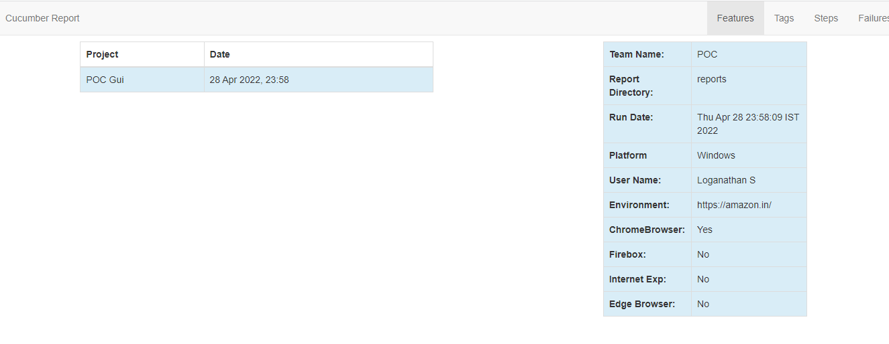
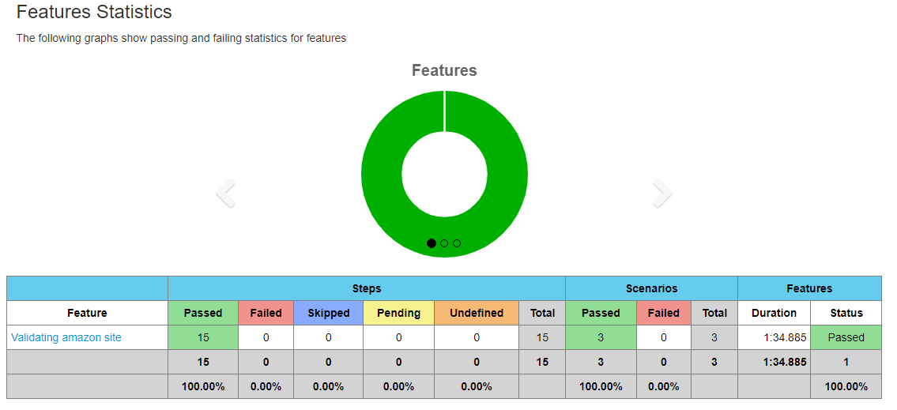
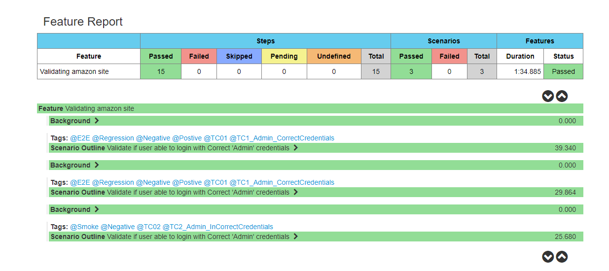
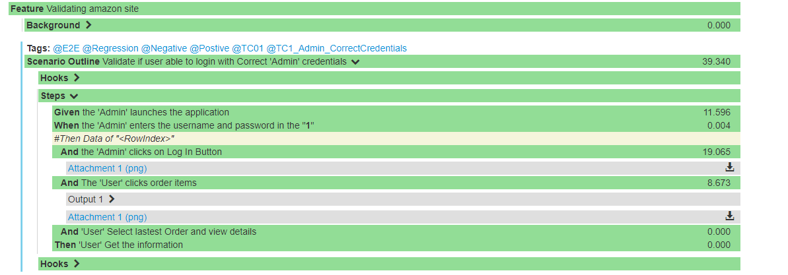
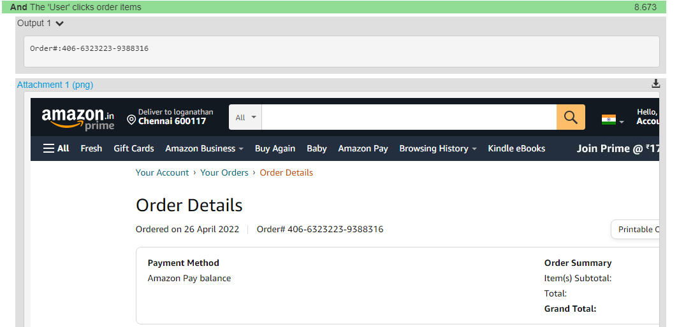

# Amazon.in Web/UI Tests #

This is a Web/UI test suite for the POC.

###Project setup
* Clone the repository using following command: `git clone` [Git](https://github.com/loganathan2022/Automation.git)
* Follow google coding standard

### Project structure
```
project-root
|
|-- src/
|   |-- test/
|       |-- java/
|               |-- BrowserAccess -Browser Operation based on Boolean 
|               |-- BusinessLogic - Actual business logic for the Test class
|               |-- PageLocators  - Object repository to hold the locators "ID","Xpath"
|               |-- Util          - All reuseable class or handling excel ,Scenario, Screenshot,Webdriver initiate
|               |-- Runner        - declared pre-test and post-test actions, hooks
|               |-- Stefdef       - step definitions
|       |-- resources/
|           |-- Feature       - test scenarios repository
|           |-- inputdata.xls - Test data
|           |-- UserCredentials.properties -User Credentials with base64 encoded
|           |-- Browser       -environment properties 

```

### Test user credentials
User credentials are stored in property files in `resources/UserCredentials` folder in following format:
`<userName>=<login>/<password>`
* `userName` - user identification within framework
* `login` - user login e.g. email address
* `password` - Base64 encoded password

**Note!** Passwords with special characters e.g. `#`, `!` etc. might throw exceptions when running the tests.
To avoid such cases, convert special characters to `Unicode` and then apply Base64 encoding.

e.g. Original password: `Test#Test` > Unicode password: `Testu0023Test` > Encoded password: `VGVzdHUwMDIzVGVzdA==`

### How do I run the tests via IntelliJ?
* Go to `Run` > `Edit Configurations` > Click on `+` > `TestNg`

Supply following information:

Field     | Value
--------- |---------
Class     | Runner.TestRunner


### Supported configurations

#### Browsers
    - Chrome

#### Environments
    - dev
    - qa
    - PP
#### Test Reports
    - CO-reports
    

#### Browser  Details

\-                 | Accepted values
---------          | ---------    
ChromeBrowser      |  `Yes`
FirefoxBrowser     |  `No`  
InternetExplorer   |  `No`
EdgeBrowser        |  `No`
Environment        |  `dev`, `qa`,`pp`
#### Environment Details

Environment             | Accepted values
---------          | ---------    
URL                |  `URl=https://amazon.in/
`

### Background

Cucumber is a test automation tool following the principles of Behavioural Driven Design and living documentation. Specifications are written in a concise human readable form and executed in TestNg/Maven Goal.

This project allows you to publish the results of a cucumber run as pretty html reports. In order for this to work you must generate a cucumber json report. The project converts the json report into an overview html linking to separate feature files with stats and results.
###Feature Report:

####Feature Overview:

####Feature Overview:


#### Scenario based overview



#### Log and Screenshots


